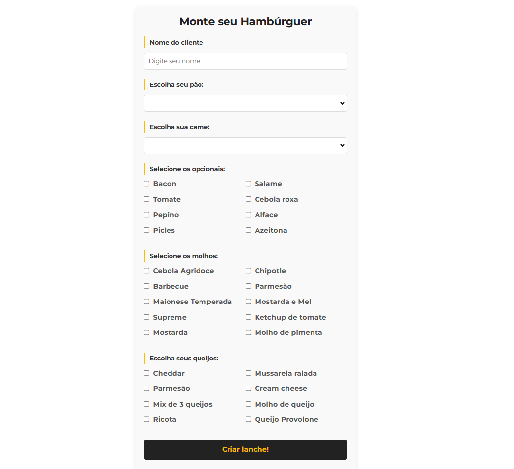
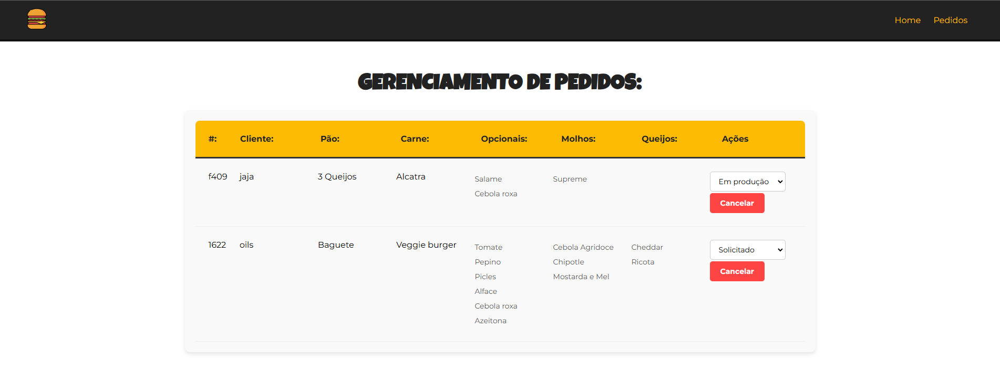

# hamburgeuria

# Projeto de Gerenciamento de Pedidos de Hambúrguer

Este é um projeto simples feito com Vue.js para gerenciar pedidos de hambúrgueres. Ele permite que os usuários criem pedidos personalizados, visualizem os pedidos feitos e gerenciem o status de cada pedido. A aplicação é fácil de usar e funciona bem em diferentes dispositivos, como celulares e computadores.

## O que o Projeto Faz?

- **Criar Pedidos**: Você pode montar seu hambúrguer escolhendo o tipo de pão, carne, queijos, molhos e outros opcionais.
- **Ver Pedidos**: Todos os pedidos feitos são exibidos em uma tabela, onde você pode ver os detalhes de cada um.
- **Gerenciar Pedidos**: Você pode atualizar o status do pedido (por exemplo, de "Solicitado" para "Em preparação") ou cancelar um pedido.
- **Mensagens de Feedback**: A aplicação mostra mensagens de sucesso quando você cria, atualiza ou cancela um pedido.

## Tecnologias Usadas
 - Vue.js: Para construir a interface do usuário.

 - Vue Router: Para navegar entre as páginas.

 - Fetch API: Para fazer requisições à API e salvar os pedidos.
 

 

 